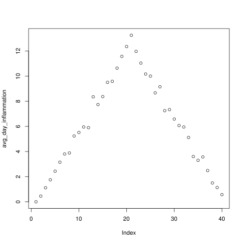
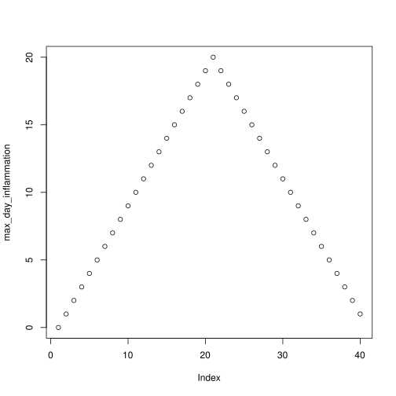
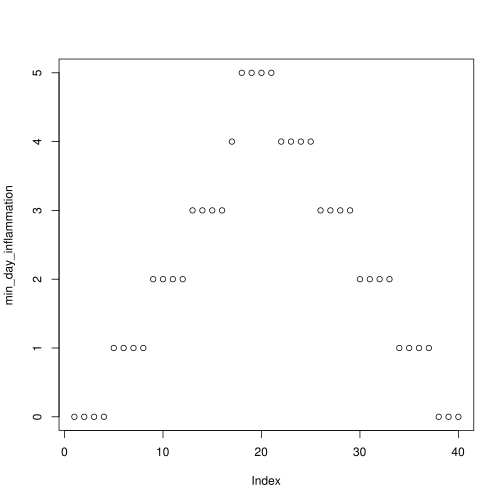

---
layout: lesson
title: Introduction to Data Science using R
subtitle: Interacting with Data
minutes: 30
---

> ## Learning objectives {.objectives}
> * Read tabular data from a file into a program
> * Assign values to variables
> * Select individual values and subsections from data
> * Perform operations on a dat frame of data
> * Display simple graphs

## Data Preparation

As we are using the Palmetto Supercomputer, we need to get the data, and upload the data onto the Supercomputer
before R can read the data. This is done via the following steps:

- Open a web browse, and download the data from https://github.com/clemsonciti/data-science-r-01/raw/gh-pages/r-novice-inflammation-data.zip to your computer and unzip this file
- Create a directory named **intro-data-science** in your Palmetto home directory
- Create a directory named **data** inside **intro-data-science**
- Upload the files from the unzipped **r-novice-inflammation-data** directory on your computer onto the **data** directory

## Loading Data

To load our inflammation data, first we need to tell our computer where is the file that contains the values. We have been told its name is inflammation-01.csv. This is very important in R, if we forget this step we’ll get an error message when trying to read the file. We can change the current working directory using the function setwd. For this example, we change the path to the directory we just created:


```R
setwd("/home/lngo/intro-data-science/")
```

The data files are located in the directory **data** inside the working directory. Now we can load the data into R using read.csv:


```R
read.csv(file="data/inflammation-01.csv", header=FALSE)
```


<table>
<thead><tr><th></th><th scope=col>V1</th><th scope=col>V2</th><th scope=col>V3</th><th scope=col>V4</th><th scope=col>V5</th><th scope=col>V6</th><th scope=col>V7</th><th scope=col>V8</th><th scope=col>V9</th><th scope=col>V10</th><th scope=col>ellip.h</th><th scope=col>V31</th><th scope=col>V32</th><th scope=col>V33</th><th scope=col>V34</th><th scope=col>V35</th><th scope=col>V36</th><th scope=col>V37</th><th scope=col>V38</th><th scope=col>V39</th><th scope=col>V40</th></tr></thead>
<tbody>
	<tr><th scope=row>1</th><td>0</td><td>0</td><td>1</td><td>3</td><td>1</td><td>2</td><td>4</td><td>7</td><td>8</td><td>3</td><td>⋯</td><td>4</td><td>4</td><td>5</td><td>7</td><td>3</td><td>4</td><td>2</td><td>3</td><td>0</td><td>0</td></tr>
	<tr><th scope=row>2</th><td>0</td><td>1</td><td>2</td><td>1</td><td>2</td><td>1</td><td>3</td><td>2</td><td>2</td><td>6</td><td>⋯</td><td>3</td><td>5</td><td>4</td><td>4</td><td>5</td><td>5</td><td>1</td><td>1</td><td>0</td><td>1</td></tr>
	<tr><th scope=row>3</th><td>0</td><td>1</td><td>1</td><td>3</td><td>3</td><td>2</td><td>6</td><td>2</td><td>5</td><td>9</td><td>⋯</td><td>10</td><td>5</td><td>4</td><td>2</td><td>2</td><td>3</td><td>2</td><td>2</td><td>1</td><td>1</td></tr>
	<tr><th scope=row>4</th><td>0</td><td>0</td><td>2</td><td>0</td><td>4</td><td>2</td><td>2</td><td>1</td><td>6</td><td>7</td><td>⋯</td><td>3</td><td>5</td><td>6</td><td>3</td><td>3</td><td>4</td><td>2</td><td>3</td><td>2</td><td>1</td></tr>
	<tr><th scope=row>5</th><td>0</td><td>1</td><td>1</td><td>3</td><td>3</td><td>1</td><td>3</td><td>5</td><td>2</td><td>4</td><td>⋯</td><td>9</td><td>6</td><td>3</td><td>2</td><td>2</td><td>4</td><td>2</td><td>0</td><td>1</td><td>1</td></tr>
	<tr><th scope=row>6</th><td>0</td><td>0</td><td>1</td><td>2</td><td>2</td><td>4</td><td>2</td><td>1</td><td>6</td><td>4</td><td>⋯</td><td>8</td><td>4</td><td>7</td><td>3</td><td>5</td><td>4</td><td>4</td><td>3</td><td>2</td><td>1</td></tr>
	<tr><th scope=row>7</th><td>0</td><td>0</td><td>2</td><td>2</td><td>4</td><td>2</td><td>2</td><td>5</td><td>5</td><td>8</td><td>⋯</td><td>8</td><td>8</td><td>4</td><td>2</td><td>3</td><td>5</td><td>4</td><td>1</td><td>1</td><td>1</td></tr>
	<tr><th scope=row>8</th><td>0</td><td>0</td><td>1</td><td>2</td><td>3</td><td>1</td><td>2</td><td>3</td><td>5</td><td>3</td><td>⋯</td><td>4</td><td>9</td><td>3</td><td>5</td><td>2</td><td>5</td><td>3</td><td>2</td><td>2</td><td>1</td></tr>
	<tr><th scope=row>9</th><td>0</td><td>0</td><td>0</td><td>3</td><td>1</td><td>5</td><td>6</td><td>5</td><td>5</td><td>8</td><td>⋯</td><td>4</td><td>6</td><td>4</td><td>7</td><td>6</td><td>3</td><td>2</td><td>1</td><td>0</td><td>0</td></tr>
	<tr><th scope=row>10</th><td>0</td><td>1</td><td>1</td><td>2</td><td>1</td><td>3</td><td>5</td><td>3</td><td>5</td><td>8</td><td>⋯</td><td>2</td><td>5</td><td>4</td><td>5</td><td>1</td><td>4</td><td>1</td><td>2</td><td>0</td><td>0</td></tr>
	<tr><th scope=row>11</th><td>0</td><td>1</td><td>0</td><td>0</td><td>4</td><td>3</td><td>3</td><td>5</td><td>5</td><td>4</td><td>⋯</td><td>4</td><td>3</td><td>4</td><td>5</td><td>5</td><td>3</td><td>3</td><td>2</td><td>2</td><td>1</td></tr>
	<tr><th scope=row>12</th><td>0</td><td>1</td><td>0</td><td>0</td><td>3</td><td>4</td><td>2</td><td>7</td><td>8</td><td>5</td><td>⋯</td><td>8</td><td>3</td><td>5</td><td>4</td><td>5</td><td>5</td><td>4</td><td>0</td><td>1</td><td>1</td></tr>
	<tr><th scope=row>13</th><td>0</td><td>0</td><td>2</td><td>1</td><td>4</td><td>3</td><td>6</td><td>4</td><td>6</td><td>7</td><td>⋯</td><td>5</td><td>4</td><td>7</td><td>3</td><td>5</td><td>4</td><td>2</td><td>3</td><td>0</td><td>1</td></tr>
	<tr><th scope=row>14</th><td>0</td><td>0</td><td>0</td><td>0</td><td>1</td><td>3</td><td>1</td><td>6</td><td>6</td><td>5</td><td>⋯</td><td>5</td><td>8</td><td>7</td><td>4</td><td>6</td><td>4</td><td>1</td><td>3</td><td>0</td><td>0</td></tr>
	<tr><th scope=row>15</th><td>0</td><td>1</td><td>2</td><td>1</td><td>1</td><td>1</td><td>4</td><td>1</td><td>5</td><td>2</td><td>⋯</td><td>8</td><td>2</td><td>5</td><td>1</td><td>3</td><td>4</td><td>2</td><td>0</td><td>2</td><td>0</td></tr>
	<tr><th scope=row>16</th><td>0</td><td>1</td><td>1</td><td>0</td><td>1</td><td>2</td><td>4</td><td>3</td><td>6</td><td>4</td><td>⋯</td><td>10</td><td>9</td><td>5</td><td>6</td><td>5</td><td>3</td><td>4</td><td>2</td><td>2</td><td>0</td></tr>
	<tr><th scope=row>17</th><td>0</td><td>0</td><td>0</td><td>0</td><td>2</td><td>3</td><td>6</td><td>5</td><td>7</td><td>4</td><td>⋯</td><td>9</td><td>8</td><td>7</td><td>5</td><td>3</td><td>1</td><td>4</td><td>0</td><td>2</td><td>1</td></tr>
	<tr><th scope=row>18</th><td>0</td><td>0</td><td>0</td><td>1</td><td>2</td><td>1</td><td>4</td><td>3</td><td>6</td><td>7</td><td>⋯</td><td>2</td><td>3</td><td>6</td><td>5</td><td>4</td><td>2</td><td>3</td><td>0</td><td>1</td><td>0</td></tr>
	<tr><th scope=row>19</th><td>0</td><td>0</td><td>2</td><td>1</td><td>2</td><td>5</td><td>4</td><td>2</td><td>7</td><td>8</td><td>⋯</td><td>6</td><td>9</td><td>2</td><td>1</td><td>1</td><td>2</td><td>2</td><td>0</td><td>1</td><td>0</td></tr>
	<tr><th scope=row>20</th><td>0</td><td>1</td><td>2</td><td>0</td><td>1</td><td>4</td><td>3</td><td>2</td><td>2</td><td>7</td><td>⋯</td><td>6</td><td>6</td><td>6</td><td>1</td><td>1</td><td>2</td><td>4</td><td>3</td><td>1</td><td>1</td></tr>
	<tr><th scope=row>21</th><td>0</td><td>1</td><td>1</td><td>3</td><td>1</td><td>4</td><td>4</td><td>1</td><td>8</td><td>2</td><td>⋯</td><td>3</td><td>2</td><td>4</td><td>3</td><td>1</td><td>5</td><td>4</td><td>2</td><td>2</td><td>0</td></tr>
	<tr><th scope=row>22</th><td>0</td><td>0</td><td>2</td><td>3</td><td>2</td><td>3</td><td>2</td><td>6</td><td>3</td><td>8</td><td>⋯</td><td>8</td><td>5</td><td>6</td><td>6</td><td>1</td><td>4</td><td>3</td><td>0</td><td>2</td><td>0</td></tr>
	<tr><th scope=row>23</th><td>0</td><td>0</td><td>0</td><td>3</td><td>4</td><td>5</td><td>1</td><td>7</td><td>7</td><td>8</td><td>⋯</td><td>4</td><td>4</td><td>8</td><td>2</td><td>6</td><td>5</td><td>1</td><td>0</td><td>1</td><td>0</td></tr>
	<tr><th scope=row>24</th><td>0</td><td>1</td><td>1</td><td>1</td><td>1</td><td>3</td><td>3</td><td>2</td><td>6</td><td>3</td><td>⋯</td><td>5</td><td>3</td><td>5</td><td>1</td><td>1</td><td>4</td><td>4</td><td>1</td><td>2</td><td>0</td></tr>
	<tr><th scope=row>25</th><td>0</td><td>1</td><td>1</td><td>1</td><td>2</td><td>3</td><td>5</td><td>3</td><td>6</td><td>3</td><td>⋯</td><td>5</td><td>5</td><td>6</td><td>1</td><td>1</td><td>1</td><td>1</td><td>0</td><td>2</td><td>1</td></tr>
	<tr><th scope=row>26</th><td>0</td><td>0</td><td>2</td><td>1</td><td>3</td><td>3</td><td>2</td><td>7</td><td>4</td><td>4</td><td>⋯</td><td>8</td><td>5</td><td>7</td><td>2</td><td>2</td><td>4</td><td>1</td><td>1</td><td>1</td><td>0</td></tr>
	<tr><th scope=row>27</th><td>0</td><td>0</td><td>1</td><td>2</td><td>4</td><td>2</td><td>2</td><td>3</td><td>5</td><td>7</td><td>⋯</td><td>7</td><td>4</td><td>8</td><td>2</td><td>2</td><td>1</td><td>3</td><td>0</td><td>1</td><td>1</td></tr>
	<tr><th scope=row>28</th><td>0</td><td>0</td><td>1</td><td>1</td><td>1</td><td>5</td><td>1</td><td>5</td><td>2</td><td>2</td><td>⋯</td><td>9</td><td>4</td><td>5</td><td>3</td><td>2</td><td>5</td><td>4</td><td>3</td><td>2</td><td>1</td></tr>
	<tr><th scope=row>29</th><td>0</td><td>0</td><td>2</td><td>2</td><td>3</td><td>4</td><td>6</td><td>3</td><td>7</td><td>6</td><td>⋯</td><td>7</td><td>7</td><td>8</td><td>3</td><td>5</td><td>4</td><td>1</td><td>3</td><td>1</td><td>0</td></tr>
	<tr><th scope=row>30</th><td>0</td><td>0</td><td>0</td><td>1</td><td>4</td><td>4</td><td>6</td><td>3</td><td>8</td><td>6</td><td>⋯</td><td>6</td><td>9</td><td>5</td><td>5</td><td>2</td><td>5</td><td>2</td><td>1</td><td>0</td><td>1</td></tr>
	<tr><th scope=row>31</th><td>0</td><td>1</td><td>1</td><td>0</td><td>3</td><td>2</td><td>4</td><td>6</td><td>8</td><td>6</td><td>⋯</td><td>10</td><td>4</td><td>2</td><td>6</td><td>5</td><td>5</td><td>2</td><td>3</td><td>2</td><td>1</td></tr>
	<tr><th scope=row>32</th><td>0</td><td>0</td><td>2</td><td>3</td><td>3</td><td>4</td><td>5</td><td>3</td><td>6</td><td>7</td><td>⋯</td><td>3</td><td>6</td><td>6</td><td>4</td><td>5</td><td>2</td><td>2</td><td>3</td><td>0</td><td>0</td></tr>
	<tr><th scope=row>33</th><td>0</td><td>1</td><td>2</td><td>2</td><td>2</td><td>3</td><td>6</td><td>6</td><td>6</td><td>7</td><td>⋯</td><td>5</td><td>8</td><td>5</td><td>2</td><td>5</td><td>5</td><td>2</td><td>0</td><td>2</td><td>1</td></tr>
	<tr><th scope=row>34</th><td>0</td><td>0</td><td>2</td><td>1</td><td>3</td><td>5</td><td>6</td><td>7</td><td>5</td><td>8</td><td>⋯</td><td>2</td><td>9</td><td>7</td><td>2</td><td>4</td><td>2</td><td>1</td><td>2</td><td>1</td><td>1</td></tr>
	<tr><th scope=row>35</th><td>0</td><td>0</td><td>1</td><td>2</td><td>4</td><td>1</td><td>5</td><td>5</td><td>2</td><td>3</td><td>⋯</td><td>5</td><td>6</td><td>6</td><td>2</td><td>3</td><td>5</td><td>2</td><td>1</td><td>1</td><td>1</td></tr>
	<tr><th scope=row>36</th><td>0</td><td>0</td><td>0</td><td>3</td><td>1</td><td>3</td><td>6</td><td>4</td><td>3</td><td>4</td><td>⋯</td><td>3</td><td>9</td><td>5</td><td>1</td><td>6</td><td>5</td><td>4</td><td>2</td><td>2</td><td>0</td></tr>
	<tr><th scope=row>37</th><td>0</td><td>1</td><td>2</td><td>2</td><td>2</td><td>5</td><td>5</td><td>1</td><td>4</td><td>6</td><td>⋯</td><td>6</td><td>4</td><td>5</td><td>4</td><td>6</td><td>3</td><td>4</td><td>3</td><td>2</td><td>1</td></tr>
	<tr><th scope=row>38</th><td>0</td><td>1</td><td>1</td><td>2</td><td>3</td><td>1</td><td>5</td><td>1</td><td>2</td><td>2</td><td>⋯</td><td>9</td><td>9</td><td>5</td><td>4</td><td>4</td><td>2</td><td>1</td><td>0</td><td>1</td><td>0</td></tr>
	<tr><th scope=row>39</th><td>0</td><td>1</td><td>0</td><td>3</td><td>2</td><td>4</td><td>1</td><td>1</td><td>5</td><td>9</td><td>⋯</td><td>5</td><td>5</td><td>2</td><td>1</td><td>1</td><td>1</td><td>1</td><td>3</td><td>0</td><td>1</td></tr>
	<tr><th scope=row>40</th><td>0</td><td>1</td><td>1</td><td>3</td><td>1</td><td>1</td><td>5</td><td>5</td><td>3</td><td>7</td><td>⋯</td><td>2</td><td>3</td><td>6</td><td>3</td><td>3</td><td>5</td><td>4</td><td>3</td><td>2</td><td>1</td></tr>
	<tr><th scope=row>41</th><td>0</td><td>0</td><td>0</td><td>2</td><td>2</td><td>1</td><td>3</td><td>4</td><td>5</td><td>5</td><td>⋯</td><td>2</td><td>9</td><td>6</td><td>2</td><td>2</td><td>5</td><td>3</td><td>0</td><td>0</td><td>1</td></tr>
	<tr><th scope=row>42</th><td>0</td><td>0</td><td>1</td><td>3</td><td>3</td><td>1</td><td>2</td><td>1</td><td>8</td><td>9</td><td>⋯</td><td>4</td><td>8</td><td>2</td><td>6</td><td>6</td><td>4</td><td>2</td><td>2</td><td>0</td><td>0</td></tr>
	<tr><th scope=row>43</th><td>0</td><td>1</td><td>1</td><td>3</td><td>4</td><td>5</td><td>2</td><td>1</td><td>3</td><td>7</td><td>⋯</td><td>5</td><td>8</td><td>5</td><td>5</td><td>6</td><td>1</td><td>2</td><td>1</td><td>2</td><td>0</td></tr>
	<tr><th scope=row>44</th><td>0</td><td>0</td><td>1</td><td>3</td><td>1</td><td>4</td><td>3</td><td>6</td><td>7</td><td>8</td><td>⋯</td><td>10</td><td>2</td><td>5</td><td>1</td><td>5</td><td>4</td><td>2</td><td>1</td><td>0</td><td>1</td></tr>
	<tr><th scope=row>45</th><td>0</td><td>1</td><td>1</td><td>3</td><td>3</td><td>4</td><td>4</td><td>6</td><td>3</td><td>4</td><td>⋯</td><td>10</td><td>6</td><td>8</td><td>7</td><td>2</td><td>5</td><td>4</td><td>3</td><td>1</td><td>1</td></tr>
	<tr><th scope=row>46</th><td>0</td><td>1</td><td>2</td><td>2</td><td>4</td><td>3</td><td>1</td><td>4</td><td>8</td><td>9</td><td>⋯</td><td>5</td><td>8</td><td>4</td><td>4</td><td>5</td><td>2</td><td>4</td><td>1</td><td>1</td><td>0</td></tr>
	<tr><th scope=row>47</th><td>0</td><td>0</td><td>2</td><td>3</td><td>4</td><td>5</td><td>4</td><td>6</td><td>2</td><td>9</td><td>⋯</td><td>6</td><td>7</td><td>6</td><td>5</td><td>1</td><td>3</td><td>1</td><td>0</td><td>0</td><td>0</td></tr>
	<tr><th scope=row>48</th><td>0</td><td>1</td><td>1</td><td>3</td><td>1</td><td>4</td><td>6</td><td>2</td><td>8</td><td>2</td><td>⋯</td><td>6</td><td>9</td><td>5</td><td>6</td><td>1</td><td>1</td><td>2</td><td>1</td><td>2</td><td>1</td></tr>
	<tr><th scope=row>49</th><td>0</td><td>0</td><td>1</td><td>3</td><td>2</td><td>5</td><td>1</td><td>2</td><td>7</td><td>6</td><td>⋯</td><td>10</td><td>7</td><td>6</td><td>3</td><td>1</td><td>5</td><td>4</td><td>3</td><td>0</td><td>0</td></tr>
	<tr><th scope=row>50</th><td>0</td><td>0</td><td>1</td><td>2</td><td>3</td><td>4</td><td>5</td><td>7</td><td>5</td><td>4</td><td>⋯</td><td>4</td><td>6</td><td>2</td><td>4</td><td>1</td><td>4</td><td>2</td><td>2</td><td>2</td><td>1</td></tr>
	<tr><th scope=row>51</th><td>0</td><td>1</td><td>2</td><td>1</td><td>1</td><td>3</td><td>5</td><td>3</td><td>6</td><td>3</td><td>⋯</td><td>7</td><td>9</td><td>3</td><td>3</td><td>6</td><td>3</td><td>4</td><td>1</td><td>2</td><td>0</td></tr>
	<tr><th scope=row>52</th><td>0</td><td>1</td><td>2</td><td>2</td><td>3</td><td>5</td><td>2</td><td>4</td><td>5</td><td>6</td><td>⋯</td><td>8</td><td>5</td><td>4</td><td>1</td><td>3</td><td>2</td><td>1</td><td>3</td><td>1</td><td>0</td></tr>
	<tr><th scope=row>53</th><td>0</td><td>0</td><td>0</td><td>2</td><td>4</td><td>4</td><td>5</td><td>3</td><td>3</td><td>3</td><td>⋯</td><td>10</td><td>8</td><td>7</td><td>5</td><td>2</td><td>2</td><td>4</td><td>1</td><td>2</td><td>1</td></tr>
	<tr><th scope=row>54</th><td>0</td><td>0</td><td>2</td><td>1</td><td>1</td><td>4</td><td>4</td><td>7</td><td>2</td><td>9</td><td>⋯</td><td>7</td><td>6</td><td>5</td><td>4</td><td>1</td><td>4</td><td>2</td><td>2</td><td>2</td><td>1</td></tr>
	<tr><th scope=row>55</th><td>0</td><td>1</td><td>2</td><td>1</td><td>1</td><td>4</td><td>5</td><td>4</td><td>4</td><td>5</td><td>⋯</td><td>4</td><td>5</td><td>5</td><td>2</td><td>2</td><td>5</td><td>1</td><td>0</td><td>0</td><td>1</td></tr>
	<tr><th scope=row>56</th><td>0</td><td>0</td><td>1</td><td>3</td><td>2</td><td>3</td><td>6</td><td>4</td><td>5</td><td>7</td><td>⋯</td><td>3</td><td>5</td><td>3</td><td>5</td><td>4</td><td>5</td><td>3</td><td>3</td><td>0</td><td>1</td></tr>
	<tr><th scope=row>57</th><td>0</td><td>1</td><td>1</td><td>2</td><td>2</td><td>5</td><td>1</td><td>7</td><td>4</td><td>2</td><td>⋯</td><td>7</td><td>7</td><td>5</td><td>6</td><td>3</td><td>4</td><td>2</td><td>2</td><td>1</td><td>1</td></tr>
	<tr><th scope=row>58</th><td>0</td><td>1</td><td>1</td><td>1</td><td>4</td><td>1</td><td>6</td><td>4</td><td>6</td><td>3</td><td>⋯</td><td>8</td><td>6</td><td>6</td><td>4</td><td>3</td><td>5</td><td>2</td><td>1</td><td>1</td><td>1</td></tr>
	<tr><th scope=row>59</th><td>0</td><td>0</td><td>0</td><td>1</td><td>4</td><td>5</td><td>6</td><td>3</td><td>8</td><td>7</td><td>⋯</td><td>10</td><td>8</td><td>8</td><td>6</td><td>5</td><td>5</td><td>2</td><td>0</td><td>2</td><td>0</td></tr>
	<tr><th scope=row>60</th><td>0</td><td>0</td><td>1</td><td>0</td><td>3</td><td>2</td><td>5</td><td>4</td><td>8</td><td>2</td><td>⋯</td><td>8</td><td>5</td><td>3</td><td>5</td><td>4</td><td>1</td><td>3</td><td>1</td><td>1</td><td>0</td></tr>
</tbody>
</table>


The expression `read.csv(...)` is a function call that asks R to run the function `read.csv`.

`read.csv` has two arguments: 
- the name of the file we want to read, and 
- whether the first line of the file contains names for the columns of data.

The filename needs to be a character string, so we put it in quotes. Assigning the second argument, `header`, to be `FALSE` indicates that the data file does not have column headers. We'll talk more about the value `FALSE`, and its converse `TRUE`, in later lessons.

> ## Other Options for Reading CSV Files
> `read.csv` actually has many more arguments that you may find useful when
> importing your own data in the future. We will cover these arguments in later lessons. 

> ## Loading Data with Headers
>
> What happens if you forget to put `header = FALSE`? The default value is `header = TRUE`, which you can check with `?read.csv` or `help(read.csv)`. What do you expect will happen if you leave the default value? Before you run any code, think about what will happen to the first few rows of your data frame, and its overall size. Then run the following code and see if your expectations agree:
>
> ~~~
> read.csv(file = "data/inflammation-01.csv")
> ~~~

> {: .r}
{: .challenge}

> ## Reading Different Decimal Point Formats
>
> Depending on the country you live in, your standard can use the dot or the comma as decimal mark.
> Also, different devices or software can generate data with different decimal points.
> Take a look at `?read.csv` and write the code to load a file called `commadec.txt` that has numeric values with commas as decimal mark, separated by semicolons.
{: .challenge}

The utility of a function is that it will perform its given action on whatever value is passed to the named argument(s).
For example, in this case if we provided the name of a different file to the argument `file`, `read.csv` would read it instead.
We'll learn more of the details about functions and their arguments in the next lesson.

Since we didn't tell it to do anything else with the function's output, the console will display the full contents of the file `inflammation-01.csv`.
Try it out.

`read.csv` read the file, but we can't use data unless we assign it to a variable.
A variable is just a name for a value, such as `x`, `current_temperature`, or `subject_id`.
We can create a new variable simply by assigning a value to it using `<-`


```R
weight_kg <- 55
```

Once a variable has a value, we can print it by typing the name of the variable and hitting `Enter` (or `return`).
In general, R will print to the console any object returned by a function or operation *unless* we assign it to a variable.


```R
weight_kg
```


55


We can do arithmetic with the variable:


```R
# weight in pounds:
2.2 * weight_kg
```


121


> ## Commenting
>
> We can add comments to our code using the `#` character. It is useful to
> document our code in this way so that others (and us the next time we
> read it) have an easier time following what the code is doing.
{: .callout}

We can also change an object's value by assigning it a new value:


```R
weight_kg <- 57.5
# weight in kilograms is now
weight_kg
```


57.5


If we imagine the variable as a sticky note with a name written on it,
assignment is like putting the sticky note on a particular value. 

This means that assigning a value to one object does not change the values of other variables.
For example, let's store the subject's weight in pounds in a variable:


```R
weight_lb <- 2.2 * weight_kg
# weight in kg...
weight_kg

# ...and in pounds
weight_lb
```


57.5


126.5


and then change `weight_kg`:


```R
weight_kg <- 100.0
# weight in kg now...
weight_kg

# ...and weight in pounds still
weight_lb
```


100


126.5


Since `weight_lb` doesn't "remember" where its value came from, it isn't automatically updated when `weight_kg` changes.
This is different from the way spreadsheets work.

> ## Printing with Parentheses
>
> An alternative way to print the value of a variable is to use () around the assignment statement.
> As an example: `(total_weight <- weight_kg + weight_lb)` adds the values of `weight_kg` and `weight_lb`,
> assigns the result to the `total_weight`,
> and finally prints the assigned value of the variable `total_weight`.


Now that we know how to assign things to variables, let's re-run `read.csv` and save its result:


```R
dat <- read.csv(file = "data/inflammation-01.csv", header = FALSE)
```

This statement doesn't produce any output because assignment doesn't display anything.
If we want to check that our data has been loaded, we can print the variable's value.
However, for large data sets it is convenient to use the function `head` to display only the first few rows of data.


```R
head(dat)
```


<table>
<thead><tr><th></th><th scope=col>V1</th><th scope=col>V2</th><th scope=col>V3</th><th scope=col>V4</th><th scope=col>V5</th><th scope=col>V6</th><th scope=col>V7</th><th scope=col>V8</th><th scope=col>V9</th><th scope=col>V10</th><th scope=col>ellip.h</th><th scope=col>V31</th><th scope=col>V32</th><th scope=col>V33</th><th scope=col>V34</th><th scope=col>V35</th><th scope=col>V36</th><th scope=col>V37</th><th scope=col>V38</th><th scope=col>V39</th><th scope=col>V40</th></tr></thead>
<tbody>
	<tr><th scope=row>1</th><td>0</td><td>0</td><td>1</td><td>3</td><td>1</td><td>2</td><td>4</td><td>7</td><td>8</td><td>3</td><td>⋯</td><td>4</td><td>4</td><td>5</td><td>7</td><td>3</td><td>4</td><td>2</td><td>3</td><td>0</td><td>0</td></tr>
	<tr><th scope=row>2</th><td>0</td><td>1</td><td>2</td><td>1</td><td>2</td><td>1</td><td>3</td><td>2</td><td>2</td><td>6</td><td>⋯</td><td>3</td><td>5</td><td>4</td><td>4</td><td>5</td><td>5</td><td>1</td><td>1</td><td>0</td><td>1</td></tr>
	<tr><th scope=row>3</th><td>0</td><td>1</td><td>1</td><td>3</td><td>3</td><td>2</td><td>6</td><td>2</td><td>5</td><td>9</td><td>⋯</td><td>10</td><td>5</td><td>4</td><td>2</td><td>2</td><td>3</td><td>2</td><td>2</td><td>1</td><td>1</td></tr>
	<tr><th scope=row>4</th><td>0</td><td>0</td><td>2</td><td>0</td><td>4</td><td>2</td><td>2</td><td>1</td><td>6</td><td>7</td><td>⋯</td><td>3</td><td>5</td><td>6</td><td>3</td><td>3</td><td>4</td><td>2</td><td>3</td><td>2</td><td>1</td></tr>
	<tr><th scope=row>5</th><td>0</td><td>1</td><td>1</td><td>3</td><td>3</td><td>1</td><td>3</td><td>5</td><td>2</td><td>4</td><td>⋯</td><td>9</td><td>6</td><td>3</td><td>2</td><td>2</td><td>4</td><td>2</td><td>0</td><td>1</td><td>1</td></tr>
	<tr><th scope=row>6</th><td>0</td><td>0</td><td>1</td><td>2</td><td>2</td><td>4</td><td>2</td><td>1</td><td>6</td><td>4</td><td>⋯</td><td>8</td><td>4</td><td>7</td><td>3</td><td>5</td><td>4</td><td>4</td><td>3</td><td>2</td><td>1</td></tr>
</tbody>
</table>


> ## Assigning Values to Variables
>
> Draw diagrams showing what variables refer to what values after each statement in the following program:
>
> ~~~
> mass <- 47.5
> age <- 122
> mass <- mass * 2.0
> age <- age - 20
> ~~~
> {: .r}
{: .challenge}

### Manipulating Data

Now that our data is loaded in memory, we can start doing things with it.
First, let's ask what type of thing `dat` is:


```R
class(dat)
```


'data.frame'


The output tells us that is a data frame. Think of this structure as a spreadsheet in MS Excel that many of us are familiar with.
Data frames are very useful for storing data and you will find them elsewhere when programming in R. A typical data frame of experimental data contains individual observations in rows and variables in columns.

We can see the shape, or dimensions, of the data frame with the function `dim`:


```R
dim(dat)
```


<ol class=list-inline>
	<li>60</li>
	<li>40</li>
</ol>


This tells us that our data frame, `dat`, has 60 rows and 40 columns.

If we want to get a single value from the data frame, we can provide an index in square brackets, just as we do in math:


```R
# first value in dat
dat[1, 1]
```


0


```R
# middle value in dat
dat[30, 20]
```


16


An index like `[30, 20]` selects a single element of a data frame, but we can select whole sections as well.
For example, we can select the first ten days (columns) of values for the first four patients (rows) like this:


```R
dat[1:4, 1:10]
```


<table>
<thead><tr><th></th><th scope=col>V1</th><th scope=col>V2</th><th scope=col>V3</th><th scope=col>V4</th><th scope=col>V5</th><th scope=col>V6</th><th scope=col>V7</th><th scope=col>V8</th><th scope=col>V9</th><th scope=col>V10</th></tr></thead>
<tbody>
	<tr><th scope=row>1</th><td>0</td><td>0</td><td>1</td><td>3</td><td>1</td><td>2</td><td>4</td><td>7</td><td>8</td><td>3</td></tr>
	<tr><th scope=row>2</th><td>0</td><td>1</td><td>2</td><td>1</td><td>2</td><td>1</td><td>3</td><td>2</td><td>2</td><td>6</td></tr>
	<tr><th scope=row>3</th><td>0</td><td>1</td><td>1</td><td>3</td><td>3</td><td>2</td><td>6</td><td>2</td><td>5</td><td>9</td></tr>
	<tr><th scope=row>4</th><td>0</td><td>0</td><td>2</td><td>0</td><td>4</td><td>2</td><td>2</td><td>1</td><td>6</td><td>7</td></tr>
</tbody>
</table>


The slice`1:4` means, "Start at index 1 and go to index 4."

The slice does not need to start at 1, e.g. the line below selects rows 5 through 10:


```R
dat[5:10, 1:10]
```


<table>
<thead><tr><th></th><th scope=col>V1</th><th scope=col>V2</th><th scope=col>V3</th><th scope=col>V4</th><th scope=col>V5</th><th scope=col>V6</th><th scope=col>V7</th><th scope=col>V8</th><th scope=col>V9</th><th scope=col>V10</th></tr></thead>
<tbody>
	<tr><th scope=row>5</th><td>0</td><td>1</td><td>1</td><td>3</td><td>3</td><td>1</td><td>3</td><td>5</td><td>2</td><td>4</td></tr>
	<tr><th scope=row>6</th><td>0</td><td>0</td><td>1</td><td>2</td><td>2</td><td>4</td><td>2</td><td>1</td><td>6</td><td>4</td></tr>
	<tr><th scope=row>7</th><td>0</td><td>0</td><td>2</td><td>2</td><td>4</td><td>2</td><td>2</td><td>5</td><td>5</td><td>8</td></tr>
	<tr><th scope=row>8</th><td>0</td><td>0</td><td>1</td><td>2</td><td>3</td><td>1</td><td>2</td><td>3</td><td>5</td><td>3</td></tr>
	<tr><th scope=row>9</th><td>0</td><td>0</td><td>0</td><td>3</td><td>1</td><td>5</td><td>6</td><td>5</td><td>5</td><td>8</td></tr>
	<tr><th scope=row>10</th><td>0</td><td>1</td><td>1</td><td>2</td><td>1</td><td>3</td><td>5</td><td>3</td><td>5</td><td>8</td></tr>
</tbody>
</table>


We can use the function `c`, which stands for **c**ombine, to select non-contiguous values:


```R
dat[c(3, 8, 37, 56), c(10, 14, 29)]
```


<table>
<thead><tr><th></th><th scope=col>V10</th><th scope=col>V14</th><th scope=col>V29</th></tr></thead>
<tbody>
	<tr><th scope=row>3</th><td>9</td><td>5</td><td>4</td></tr>
	<tr><th scope=row>8</th><td>3</td><td>5</td><td>6</td></tr>
	<tr><th scope=row>37</th><td>6</td><td>9</td><td>10</td></tr>
	<tr><th scope=row>56</th><td>7</td><td>11</td><td>9</td></tr>
</tbody>
</table>


We also don't have to provide a slice for either the rows or the columns.
If we don't include a slice for the rows, R returns all the rows; if we don't include a slice for the columns, R returns all the columns.
If we don't provide a slice for either rows or columns, e.g. `dat[, ]`, R returns the full data frame.


```R
# All columns from row 5
dat[5, ]
```


<table>
<thead><tr><th></th><th scope=col>V1</th><th scope=col>V2</th><th scope=col>V3</th><th scope=col>V4</th><th scope=col>V5</th><th scope=col>V6</th><th scope=col>V7</th><th scope=col>V8</th><th scope=col>V9</th><th scope=col>V10</th><th scope=col>ellip.h</th><th scope=col>V31</th><th scope=col>V32</th><th scope=col>V33</th><th scope=col>V34</th><th scope=col>V35</th><th scope=col>V36</th><th scope=col>V37</th><th scope=col>V38</th><th scope=col>V39</th><th scope=col>V40</th></tr></thead>
<tbody>
	<tr><th scope=row>5</th><td>0</td><td>1</td><td>1</td><td>3</td><td>3</td><td>1</td><td>3</td><td>5</td><td>2</td><td>4</td><td>⋯</td><td>9</td><td>6</td><td>3</td><td>2</td><td>2</td><td>4</td><td>2</td><td>0</td><td>1</td><td>1</td></tr>
</tbody>
</table>


```R
# All rows from column 16
dat[, 16]
```


<ol class=list-inline>
	<li>4</li>
	<li>4</li>
	<li>15</li>
	<li>8</li>
	<li>10</li>
	<li>15</li>
	<li>13</li>
	<li>9</li>
	<li>11</li>
	<li>6</li>
	<li>3</li>
	<li>8</li>
	<li>12</li>
	<li>3</li>
	<li>5</li>
	<li>10</li>
	<li>11</li>
	<li>4</li>
	<li>11</li>
	<li>13</li>
	<li>15</li>
	<li>5</li>
	<li>14</li>
	<li>13</li>
	<li>4</li>
	<li>9</li>
	<li>13</li>
	<li>6</li>
	<li>7</li>
	<li>6</li>
	<li>14</li>
	<li>3</li>
	<li>15</li>
	<li>4</li>
	<li>15</li>
	<li>11</li>
	<li>7</li>
	<li>10</li>
	<li>15</li>
	<li>6</li>
	<li>5</li>
	<li>6</li>
	<li>15</li>
	<li>11</li>
	<li>15</li>
	<li>6</li>
	<li>11</li>
	<li>15</li>
	<li>14</li>
	<li>4</li>
	<li>10</li>
	<li>15</li>
	<li>11</li>
	<li>6</li>
	<li>13</li>
	<li>8</li>
	<li>4</li>
	<li>13</li>
	<li>12</li>
	<li>9</li>
</ol>


Now let's perform some common mathematical operations to learn about our inflammation data.
When analyzing data we often want to look at partial statistics, such as the maximum value per patient or the average value per day.
One way to do this is to select the data we want to create a new temporary data frame, and then perform the calculation on this subset:


```R
# first row, all of the columns
patient_1 <- dat[1, ]
# max inflammation for patient 1
max(patient_1)
```


18


> ## Forcing Conversion
>
> The code above may give you an error in some R installations,
> since R does not automatically convert a sliced row of a `data.frame` to a vector.
> (Confusingly, sliced columns are automatically converted.)
> If this happens, you can use the `as.numeric` command to convert the row of data to a numeric vector:
>
> `patient_1 <- as.numeric(dat[1, ])`
>
> `max(patient_1)`
>
> You can also check the `class` of each object:
>
> `class(dat[1, ])`
>
> `class(as.numeric(dat[1, ]))`
{: .callout}

We don't actually need to store the row in a variable of its own.
Instead, we can combine the selection and the function call:


```R
# max inflammation for patient 2
max(dat[2, ])
```


18


R also has functions for other common calculations, e.g. finding the minimum, mean, median, and standard deviation of the data:


```R
# minimum inflammation on day 7
min(dat[, 7])
```


```R
# mean inflammation on day 7
mean(dat[, 7])
```


3.8


```R
# median inflammation on day 7
median(dat[, 7])
```


4


```R
# standard deviation of inflammation on day 7
sd(dat[, 7])
```


1.72518729025016


What if we need the maximum inflammation for all patients, or the average for each day?
As the diagram below shows, we want to perform the operation across a margin of the data frame:


To support this, we can use the `apply` function.

> ## Getting Help
>
> To learn about a function in R, e.g. `apply`, we can read its help
> documention by running `help(apply)` or `?apply`.
{: .callout}

`apply` allows us to repeat a function on all of the rows (`MARGIN = 1`) or columns (`MARGIN = 2`) of a data frame.

Thus, to obtain the average inflammation of each patient we will need to calculate the mean of all of the rows (`MARGIN = 1`) of the data frame.


```R
avg_patient_inflammation <- apply(dat, 1, mean)
```


```R
avg_day_inflammation <- apply(dat, 2, mean)
```

Since the second argument to `apply` is `MARGIN`, the above command is equivalent to `apply(dat, MARGIN = 2, mean)`.
We'll learn why this is so in the next lesson.

> ## Slicing (Subsetting) Data
>
> A subsection of a data frame is called a [slice]({{ site.github.url }}/reference/#slice).
> We can take slices of character vectors as well:


```R
animal <- c("m", "o", "n", "k", "e", "y")
```


```R
# first three characters
animal[1:3]
```


<ol class=list-inline>
	<li>'m'</li>
	<li>'o'</li>
	<li>'n'</li>
</ol>


```R
 # last three characters
 animal[4:6]
```


<ol class=list-inline>
	<li>'k'</li>
	<li>'e'</li>
	<li>'y'</li>
</ol>


> 1.  If the first four characters are selected using the slice `animal[1:4]`, how can we obtain the first four characters in reverse order?
>
> 2.  What is `animal[-1]`?
>    What is `animal[-4]`?
>    Given those answers,
>    explain what `animal[-1:-4]` does.
>
> 3.  Use a slice of `animal` to create a new character vector that spells the word "eon", i.e. `c("e", "o", "n")`.
{: .challenge}

> ## Subsetting More Data
>
> Suppose you want to determine the maximum inflammation for patient 5 across days three to seven.
> To do this you would extract the relevant slice from the data frame and calculate the maximum value.
> Which of the following lines of R code gives the correct answer?
>
> 1. `max(dat[5, ])`
> 2. `max(dat[3:7, 5])`
> 3. `max(dat[5, 3:7])`
> 4. `max(dat[5, 3, 7])`
{: .challenge}

> ## Slicing and Re-Assignment
>
> Using the inflammation data frame `dat` from above:
> Let's pretend there was something wrong with the instrument on the first five days for every second patient (#2, 4, 6, etc.), which resulted in the measurements being twice as large as they should be.
>
> 1. Write a vector containing each affected patient (hint: `? seq`)
> 2. Create a new data frame with in which you halve the first five days' values in only those patients
> 3. Print out the corrected data frame to check that your code has fixed the problem
>
> > ## Solution
> > ~~~
> > whichPatients <- seq(2,40,2)
> > whichDays <- c(1:5)
> > dat2 <- dat
> > dat2[whichPatients,whichDays] <- dat2[whichPatients,whichDays]/2
> > (dat2)
> > ~~~
> > {: .r}
> {: .solution}
{: .challenge}


> ## Using the Apply Function on Patient Data
>
> Challenge: the apply function can be used to summarize datasets and subsets
> of data across rows and columns using the MARGIN argument.
> Suppose you want to calculate the mean inflammation for specific days and patients
> in the patient dataset (i.e. 60 patients across 40 days).
>
> Please use a combination of the apply function and indexing to:
>
> 1. calculate the mean inflammation for patients 1 to 5 over the whole 40 days
> 1. calculate the mean inflammation for days 1 to 10 (across all patients).
> 1. calculate the mean inflammation for every second day (across all patients).
>
> Think about the number of rows and columns you would expect as the result before each
> apply call and check your intuition by applying the mean function.

> > ## Solution
> > ~~~
> > # 1.
> > apply(dat[1:5, ], 1, mean)
> > # 2.
> > apply(dat[, 1:10], 2, mean)
> > # 3.
> > apply(dat[, seq(1,40, by=2)], 2, mean)
> > ~~~
> > {: .r}
> {: .solution}
{: .challenge}

### Plotting

The mathematician Richard Hamming once said, "The purpose of computing is insight, not numbers," and the best way to develop insight is often to visualize data.
Visualization deserves an entire lecture (or course) of its own, but we can explore a few of R's plotting features.

Let's take a look at the average inflammation over time.
Recall that we already calculated these values above using `apply(dat, 2, mean)` and saved them in the variable `avg_day_inflammation`.
Plotting the values is done with the function `plot`.


```R
plot(avg_day_inflammation)
```





Above, we gave the function `plot` a vector of numbers corresponding to the average inflammation per day across all patients.
`plot` created a scatter plot where the y-axis is the average inflammation level and the x-axis is the order, or index, of the values in the vector, which in this case correspond to the 40 days of treatment.
The result is roughly a linear rise and fall, which is suspicious: based on other studies, we expect a sharper rise and slower fall.
Let's have a look at two other statistics: the maximum and minimum inflammation per day.


```R
max_day_inflammation <- apply(dat, 2, max)
plot(max_day_inflammation)
```





```R
min_day_inflammation <- apply(dat, 2, min)
plot(min_day_inflammation)
```





The maximum value rises and falls perfectly smoothly, while the minimum seems to be a step function. Neither result seems particularly likely, so either there's a mistake in our calculations or something is wrong with our data.

> ## Plotting Data
>
> Create a plot showing the standard deviation of the inflammation data for each day across all patients.
{: .challenge}
